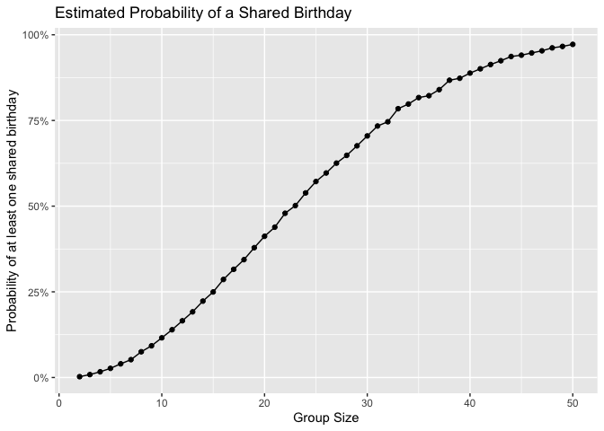
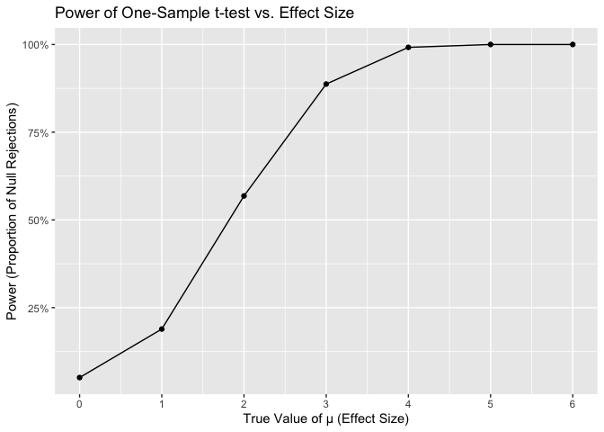

p8105_hw5_lg3450
================

first load all necessary libraries

``` r
library(tidyverse)
library(broom)
library(scales)   
library(dplyr)
```

# Problem 1

**Suppose you put n people in a room, and want to know the probability
that at least two people share a birthday. For simplicity, we’ll assume
there are no leap years (i.e. there are only 365 days) and that
birthdays are uniformly distributed over the year (which is actually not
the case).**

- Q1.1: Write a function that, for a fixed group size, randomly draws
  “birthdays” for each person; checks whether there are duplicate
  birthdays in the group; and returns TRUE or FALSE based on the result.

``` r
check_birthday = function(n) {
  #randomly draw #n birthdays from 1 to 365, allow for same bthd
  birthdays = sample(1:365, size = n, replace = TRUE)
  #logic: if length < n, duplication appears
  repeated_bthd = length(unique(birthdays)) < n
  repeated_bthd
}
```

- Q1.2: Next, run this function 10000 times for each group size between
  2 and 50. For each group size, compute the probability that at least
  two people in the group will share a birthday by averaging across the
  10000 simulation runs.

``` r
set.seed(1)

prob_results =
  expand_grid(
    group_size = 2:50,
    iter = 1:10000) |>
  mutate(
    repeated_bthd = map_dbl(group_size, check_birthday)) |>
  group_by(group_size) |>
  summarize(
    prob_shared = mean(repeated_bthd))

prob_results
```

    ## # A tibble: 49 × 2
    ##    group_size prob_shared
    ##         <int>       <dbl>
    ##  1          2     0.00240
    ##  2          3     0.00850
    ##  3          4     0.0167 
    ##  4          5     0.0267 
    ##  5          6     0.0399 
    ##  6          7     0.0521 
    ##  7          8     0.0751 
    ##  8          9     0.0925 
    ##  9         10     0.116  
    ## 10         11     0.139  
    ## # ℹ 39 more rows

- Q1.3: Make a plot showing the probability as a function of group size,
  and comment on your results.

``` r
prob_results |>
  ggplot(aes(x = group_size, y = prob_shared)) +
  geom_point() +
  geom_path() +
  labs(
    title = "Estimated Probability of a Shared Birthday",
    x = "Group Size",
    y = "Probability of at least one shared birthday"
  ) +
  scale_y_continuous(labels = percent)
```

<!-- -->

The plot illustrates a clear non-linear acceleration in probability,
rather than a steady, linear increase. This simulation confirms the
“birthday paradox,” showing the 50% probability threshold is crossed
with a group size of just 23. Following this point, the probability
rapidly converges toward certainty, reaching 97% by a group size of 50.

# Problem2

**When designing an experiment or analysis, a common question is whether
it is likely that a true effect will be detected – put differently,
whether a false null hypothesis will be rejected. The probability that a
false null hypothesis is rejected is referred to as power, and it
depends on several factors, including: the sample size; the effect size;
and the error variance. In this problem, you will conduct a simulation
to explore power in a one-sample t-test.**

First set the following design elements: Fix n = 30, fix sigma = 5. Set
$\mu\ = 0.Generate 5000 datasets from the model X∼Normal[$, sigma\].

For each dataset, save \$^ and the p-value arising from a test of H:
\$ = 0 using alpha = 0.05. Hint: to obtain the estimate aand p-value,
using broom::tidat to clean the output of t.test.

Repeat the above for \$ = {1,2,3,4,5,6}, and complete the following:

- Q2.1: Make a plot showing the proportion of times the null was
  rejected (the power of the test) on the y axis and the true value of
  \$ on the x axis. Describe the association between effect size and
  power.

``` r
set.seed(1)

run_ttest_sim = function(n_val, mu_val, sigma_val) {
  sim_data = rnorm(n = n_val, mean = mu_val, sd = sigma_val)
  tidy_result = broom::tidy(t.test(sim_data, mu = 0))
  tibble(
    mu_hat = tidy_result$estimate,
    p_value = tidy_result$p.value)
}

n_sims = 5000
n_val = 30
sigma_val = 5

power_results =
  expand_grid(
    true_mu = 0:6, 
    iter = 1:n_sims) |>
  mutate(
    results = map(true_mu, 
                  \(mu) run_ttest_sim(n_val = n_val, 
                                      mu_val = mu, 
                                      sigma_val = sigma_val))) |>
  unnest(results) |>
  group_by(true_mu) |>
  summarize(
    power = mean(p_value < 0.05))

power_plot =
  power_results |>
  ggplot(aes(x = true_mu, y = power)) +
  geom_point() +
  geom_path() + 
  labs(
    title = "Power of One-Sample t-test vs. Effect Size",
    x = "True Value of μ (Effect Size)",
    y = "Power (Proportion of Null Rejections)"
  ) +
  scale_y_continuous(labels = percent) +
  scale_x_continuous(breaks = 0:6) 

power_plot
```

<!-- -->

``` r
power_results
```

    ## # A tibble: 7 × 2
    ##   true_mu  power
    ##     <int>  <dbl>
    ## 1       0 0.0508
    ## 2       1 0.189 
    ## 3       2 0.568 
    ## 4       3 0.887 
    ## 5       4 0.992 
    ## 6       5 1     
    ## 7       6 1

Based on the plot, the association between and power is strong,
positive, and non-linear. When the effect size is 0 (namely the null
hypothesis is true), the power is low, at approximately 5%. As the
effect size increases, the power (the probability of correctly detecting
the effect) rises rapidly. The power is low for a small effect size, but
approaches 100% for large effect sizes. In short, the larger the true
effect, the more likely the test is to detect it.

- Q2.2: Make a plot showing the average estimate of \$^ on the y axis
  and the true value of \$ on the x axis.

# Problem3

**The Washington Post has gathered data on homicides in 50 large U.S.
cities and made the data available through a GitHub repository here. You
can read their accompanying article here.**

- Q3.1: Describe the raw data. Create a city_state variable
  (e.g. “Baltimore, MD”) and then summarize within cities to obtain the
  total number of homicides and the number of unsolved homicides (those
  for which the disposition is “Closed without arrest” or “Open/No
  arrest”).

``` r
homicides = read_csv("../homicide-data.csv")
```

``` r
unsolved_types = c("Open/No arrest", "Closed without arrest")

city_summary = homicides |>
  mutate(city_state = paste(city, state, sep = ", ")) |>
  mutate(unsolved = disposition %in% unsolved_types) |>
  group_by(city_state) |>
  summarize(
    total_homicides = n(),                      
    unsolved_homicides = sum(unsolved, na.rm = TRUE)) |>
  arrange(desc(total_homicides))

print(head(city_summary, 10))
```

    ## # A tibble: 10 × 3
    ##    city_state       total_homicides unsolved_homicides
    ##    <chr>                      <int>              <int>
    ##  1 Chicago, IL                 5535               4073
    ##  2 Philadelphia, PA            3037               1360
    ##  3 Houston, TX                 2942               1493
    ##  4 Baltimore, MD               2827               1825
    ##  5 Detroit, MI                 2519               1482
    ##  6 Los Angeles, CA             2257               1106
    ##  7 St. Louis, MO               1677                905
    ##  8 Dallas, TX                  1567                754
    ##  9 Memphis, TN                 1514                483
    ## 10 New Orleans, LA             1434                930

The dataset contains 52179 individual homicide records and 12 variables
describing each case.

Key geographic variables include `city` and `state`, which identify the
location. In total, the dataset spans 50 distinct cities. For more
precise spatial analysis, the dataset also provides the specific `lat`
(latitude) and `lon` (longitude) for each incident.

The dataset also includes victim demographic variables, such as their
`victim_first` and `victim_last` name. For analysis, the most relevant
demographic fields are `victim_race` and `victim_sex`, both of which are
categorical variables, and `victim_age`.

The disposition variable has three distinct levels. Running 25674, 2922,
23583 counts the total number of cases for each of these levels, which
are: ‘Closed by arrest,’ ‘Open/No arrest,’ and ‘Closed without arrest.’

- Q3.2: For the city of Baltimore, MD, use the prop.test function to
  estimate the proportion of homicides that are unsolved; save the
  output of prop.test as an R object, apply the broom::tidy to this
  object and pull the estimated proportion and confidence intervals from
  the resulting tidy dataframe.

``` r
final_baltimore_estimates =
  homicides |>
  filter(city == "Baltimore", state == "MD") |>
  summarize(
    total_homicides = n(),
    unsolved_homicides = sum(disposition %in% unsolved_types)) |>
  mutate(
    prop_test = list(
      prop.test(
        x = unsolved_homicides,
        n = total_homicides))) |>
  mutate(tidy_res = map(prop_test, broom::tidy)) |>
  select(tidy_res) |>
  unnest(tidy_res) |>
  select(
    estimate_proportion = estimate,
    conf_low = conf.low,
    conf_high = conf.high)

print(final_baltimore_estimates)
```

    ## # A tibble: 1 × 3
    ##   estimate_proportion conf_low conf_high
    ##                 <dbl>    <dbl>     <dbl>
    ## 1               0.646    0.628     0.663

# Undone

- Q3.3: Now run prop.test for each of the cities in your dataset, and
  extract both the proportion of unsolved homicides and the confidence
  interval for each. Do this within a “tidy” pipeline, making use of
  purrr::map, purrr::map2, list columns and unnest as necessary to
  create a tidy dataframe with estimated proportions and CIs for each
  city.

``` r
final_estimates =
  city_summary |>
  mutate(
    tidy_results = purrr::map2(
      .x = unsolved_homicides, 
      .y = total_homicides,
      .f = ~ tidy(prop.test(x = .x, n = .y)))) |>
  unnest(tidy_results) |>
  select(
    city_state,
    estimate_proportion = estimate,
    conf_low = conf.low,
    conf_high = conf.high
  ) |>
  arrange(desc(estimate_proportion))

print(final_estimates)
```

    ## # A tibble: 51 × 4
    ##    city_state         estimate_proportion conf_low conf_high
    ##    <chr>                            <dbl>    <dbl>     <dbl>
    ##  1 Chicago, IL                      0.736    0.724     0.747
    ##  2 New Orleans, LA                  0.649    0.623     0.673
    ##  3 Baltimore, MD                    0.646    0.628     0.663
    ##  4 San Bernardino, CA               0.618    0.558     0.675
    ##  5 Buffalo, NY                      0.612    0.569     0.654
    ##  6 Miami, FL                        0.605    0.569     0.640
    ##  7 Stockton, CA                     0.599    0.552     0.645
    ##  8 Detroit, MI                      0.588    0.569     0.608
    ##  9 Phoenix, AZ                      0.551    0.518     0.584
    ## 10 Denver, CO                       0.542    0.485     0.598
    ## # ℹ 41 more rows

- Q3.4: Create a plot that shows the estimates and CIs for each city –
  check out geom_errorbar for a way to add error bars based on the upper
  and lower limits. Organize cities according to the proportion of
  unsolved homicides.
